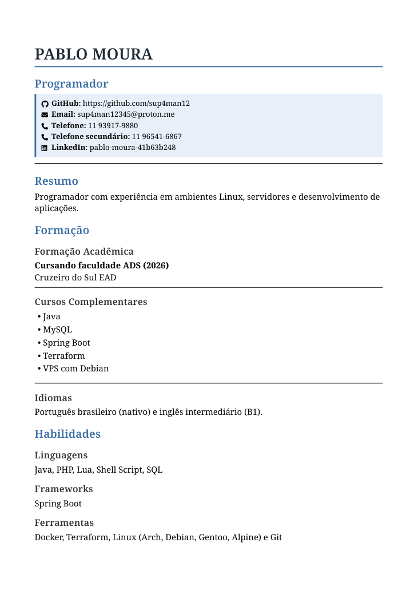

# curriculo_pandoc

Gerador de currículos com pandoc



## Dependências

- pandoc
- weasyprint

## Preparação

```sh
git clone https://github.com/sup4man12/curriculo_pandoc.git
cd curriculo_pandoc
chmod +x gencurriculo.sh
```

## Como usar

Edite o arquivo **curriculo.md** e gere o pdf com o seguinte comando:

```sh
./gencurriculo.sh

## Também é possível passar algum tema como parâmetro.
## Temas disponíveis: dark, clean, dark, modern e curriculo(padrão)
./gencurriculo.sh clean

## Ou ainda, gerar todos
./gencurriculo.sh all
```

Os currículos ficaram localizados no diretório **output**

## Estrutura de arquivos

```
curriculo/
├── css/
│   ├── curriculo.css  (padrão)
│   ├── clean.css
│   ├── modern.css
│   ├── classic.css
│   └── dark.css
├── curriculo.md
├── gencurriculo.sh
└── output/
    └── curriculo-*.pdf
```

